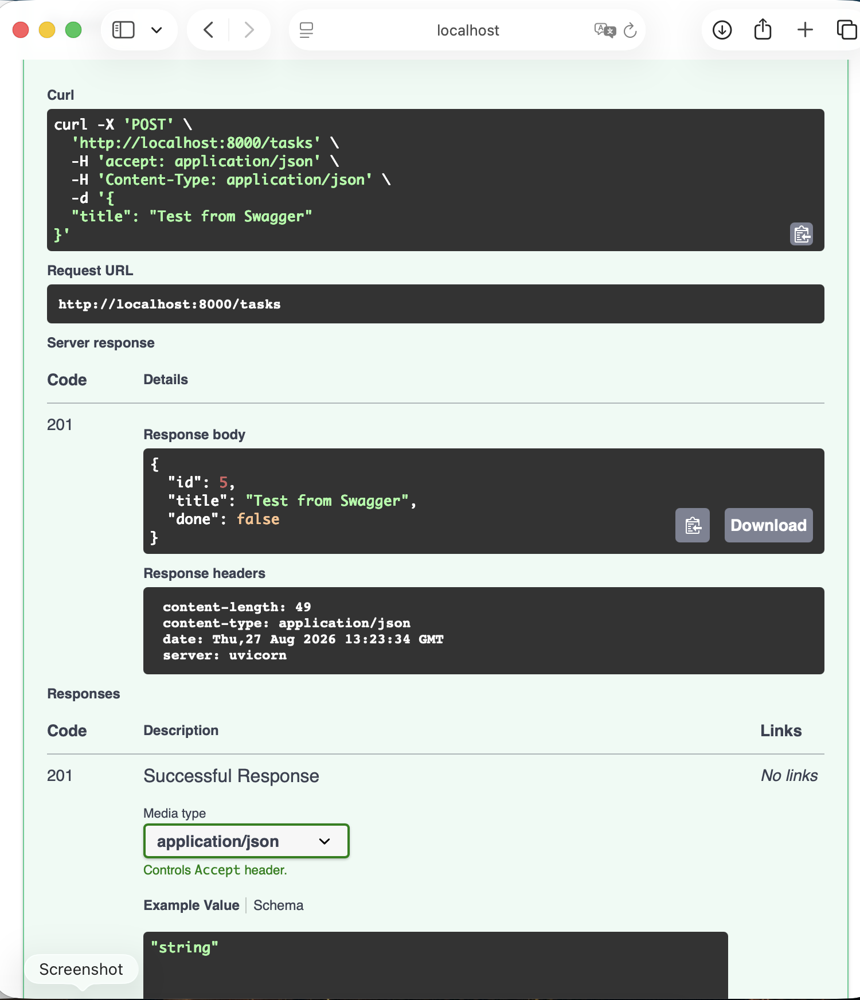
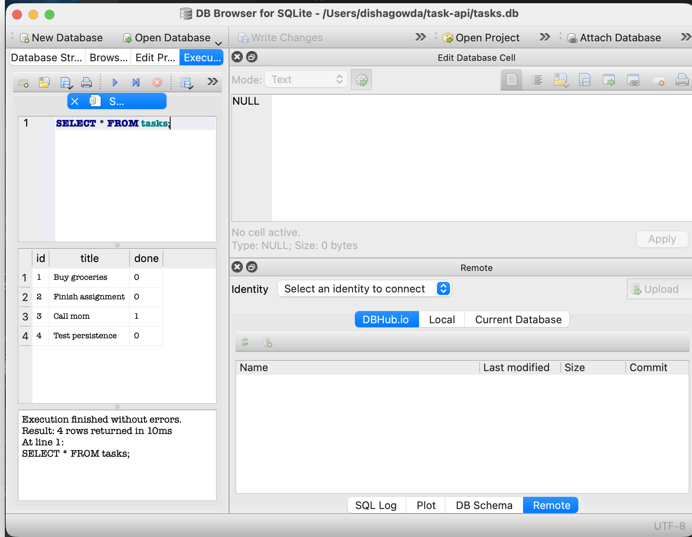
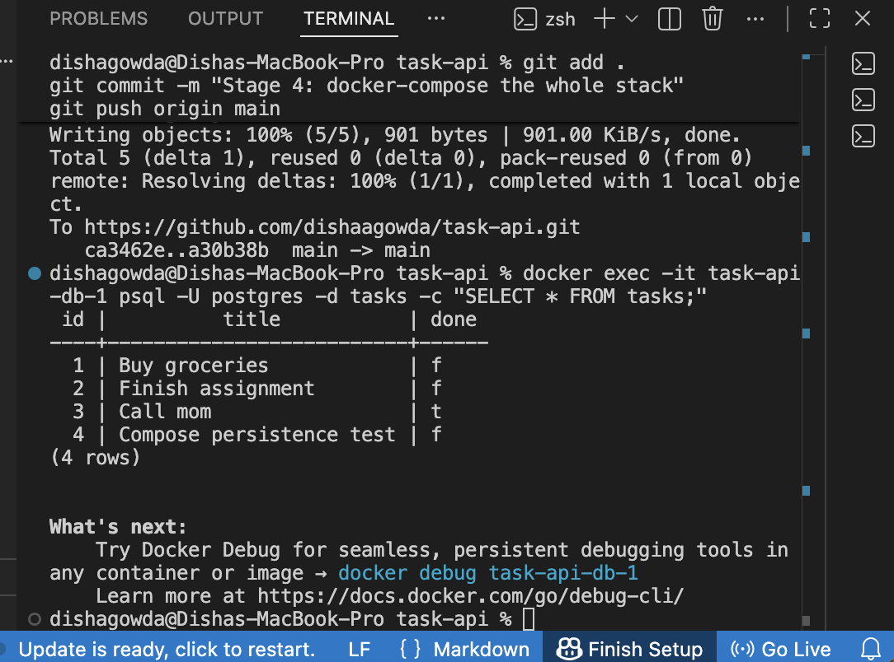
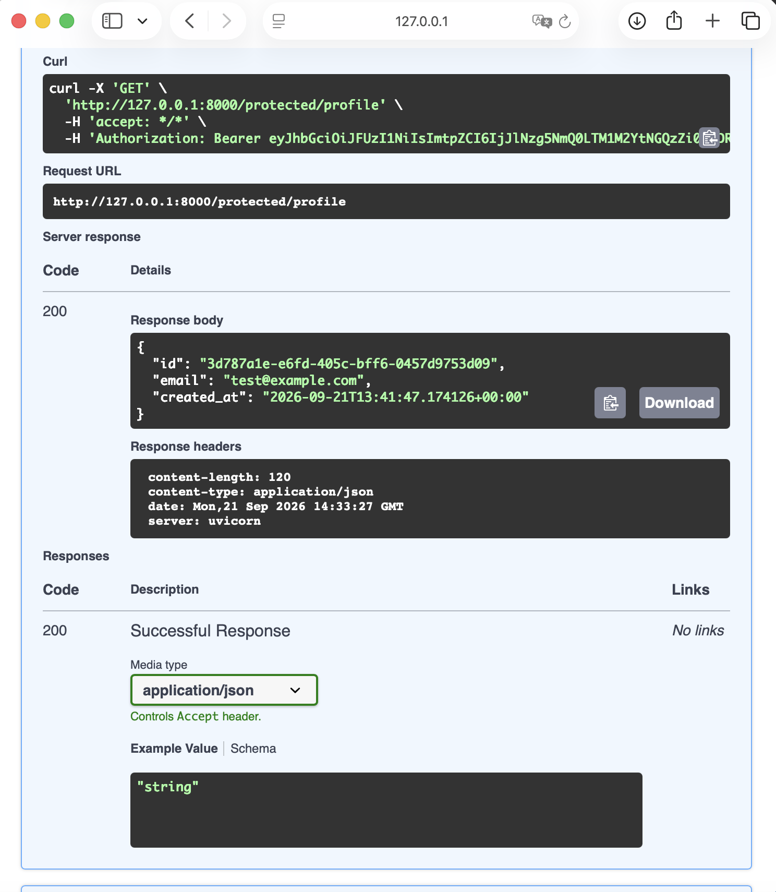

# Task API

A small backend API for managing a to-do list, built with FastAPI. Supports full CRUD (Create, Read, Update, Delete) on an in-memory list of tasks.

Built as part of the FlyRank AI Fluency internship, Backend AI Engineering track — Week 2 assignment.

## How to run it

**Requirements:** Python 3.10+

1. Clone this repo and move into it:
```
   git clone https://github.com/dishaagowda/task-api.git
   cd task-api
```

2. Install dependencies:
```
   pip3 install fastapi uvicorn
```

3. Run the server:
```
   uvicorn main:app --reload
```

4. The API is now running at `http://localhost:8000`. Interactive docs (Swagger UI) are at `http://localhost:8000/docs`.

## Endpoints

| Method | Path             | Description                          |
|--------|------------------|---------------------------------------|
| GET    | `/`              | API info (name, version, endpoints)  |
| GET    | `/health`        | Health check                         |
| GET    | `/tasks`         | List all tasks                       |
| GET    | `/tasks/{id}`    | Get a single task by ID              |
| POST   | `/tasks`         | Create a new task                    |
| PUT    | `/tasks/{id}`    | Update a task's title                |
| DELETE | `/tasks/{id}`    | Delete a task                        |

## Example request

```
curl -i -X POST http://localhost:8000/tasks -H "Content-Type: application/json" -d '{"title":"Buy milk"}'
```

```
HTTP/1.1 201 Created
content-type: application/json

{"id":4,"title":"Buy milk","done":false}
```

## Swagger UI

Full CRUD tested and working via Swagger UI's "Try it out" feature:



## Notes

Data is stored in memory only — it resets every time the server restarts. A real database will be added in a future stage.

## Database (SQLite)

**Why SQLite:** SQLite was chosen because it requires no separate 
database server — it's a single file (`tasks.db`) that gets created 
automatically the first time the app runs. This made it the simplest 
way to add real persistence without adding deployment complexity.

**Where the database file is stored:** `tasks.db`, in the project root 
folder. It's excluded from git via `.gitignore` so the database itself 
never gets committed — only the code that creates and manages it.

**How to start the project:**
```bash
uvicorn main:app --reload
```
The database and `tasks` table are created automatically on first run, 
with 3 example tasks inserted if the table is empty.

**Example SQL query:**
```sql
SELECT * FROM tasks;
```

**Database viewer screenshot:**


## Containerized Stack (Docker + Postgres)

**Run the whole stack with one command:**
```bash
docker compose up
```
This builds the app image, starts Postgres in a container with a persistent volume, 
and starts the API — connected to each other automatically.

**Environment variables:** copy `.env.example` to `.env` and fill in real values:
```bash
cp .env.example .env
```

**Endpoints:**

| Method | Path | Description |
|--------|------|-------------|
| GET | /tasks | List all tasks |
| GET | /tasks/{id} | Get one task |
| POST | /tasks | Create a task |
| PUT | /tasks/{id} | Update a task |
| DELETE | /tasks/{id} | Delete a task |

**Example request:**
```bash
curl -i http://localhost:8000/tasks
```

Response:
HTTP/1.1 200 OK
content-type: application/json
[{"id":1,"title":"Buy groceries","done":false}, ...]


**Persistence proof:** created a task, ran `docker compose down` then `docker compose up` again — the task was still present, confirming the named volume (`taskdata`) preserves data across a full stack restart.

**Database screenshot:**


## Authentication (Supabase Auth)

Adds secure user authentication on top of the existing Task API — sign up, log in, log out — and protects specific routes using Supabase-issued JWTs.

**Setup — environment variables:**

Copy `.env.example` to `.env` and fill in your own Supabase project values:

cp .env.example .env


You'll need a free Supabase project (supabase.com) — grab your Project URL and anon/publishable key from Project Settings → API.

**Run it:**

uvicorn main:app --reload


**Endpoints:**

| Method | Path | Auth required | Description |
|--------|------|----------------|-------------|
| POST | /auth/signup | No | Create a new user account |
| POST | /auth/login | No | Log in, returns access + refresh token |
| POST | /auth/logout | Yes | End the current session |
| GET | /public/info | No | Public, unprotected data |
| GET | /protected/profile | Yes | Read the logged-in user's profile |
| GET | /protected/dashboard | Yes | Second protected route, same auth middleware |

**Example — signup:**

curl -i -X POST http://localhost:8000/auth/signup -H "Content-Type: application/json" -d '{"email":"test@example.com","password":"password123"}'


**Example — accessing a protected route:**

curl -i http://localhost:8000/protected/profile -H "Authorization: Bearer <your_access_token>"


A missing or invalid token returns `401 Unauthorized`. A tampered token is rejected the same way — verified live against Supabase on every request.

**Swagger UI:**

Visit `http://localhost:8000/docs`, click the green **Authorize** button, paste your access token, and use "Try it out" directly on any protected route.



